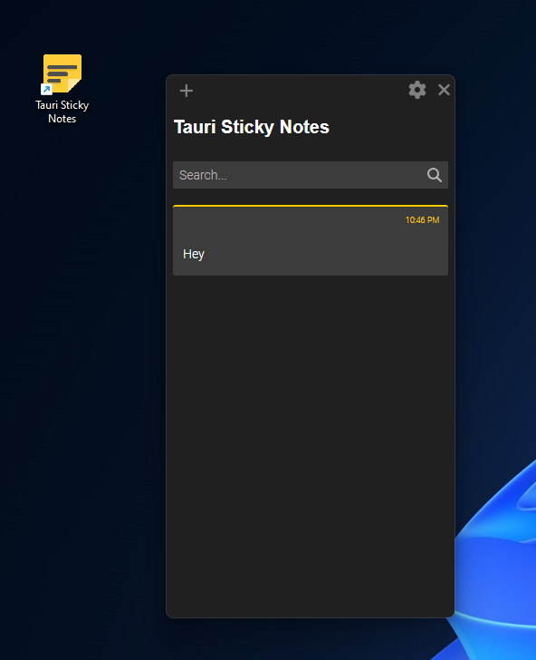

# Rust Tauri Sticky Notes Application

A simple Sticky Notes application built with Rust Tauri and React, allowing users to create, edit, search, and delete notes.

## Table of Contents

- [Demo](#demo)
- [Features](#features)
- [Prerequisites](#prerequisites)
- [Getting Started](#getting-started)
- [Usage](#usage)
- [Contributing](#contributing)
- [License](#license)

## Demo

[Video Demo](https://youtube.com/shorts/elEavBdjK3E)

## Features

- **Create Notes:** Create one or multiple sticky notes with content.

- **Edit Notes:** Easily modify the content of existing notes.

- **Delete Notes:** Remove unwanted notes from your collection.

- **Search Notes:** Quickly find notes using a search feature.

## Prerequisites

Before you can use the Sticky Notes application, make sure you have the following dependencies installed:

Rust
Node
MongoDB

## Getting Started

1. clone the repo

2. npm install in the root directory. 

3. cd into the rust_backend folder.

4. run command cargo run. this will start a mongodb server locally on your pc.

5. run command npm run tauri dev in the root folder while server is running.

6. enjoy!

## Usage

- Launch the application, and you'll be presented with the Sticky Notes interface.
- To create a new note, click the + button.
- To edit an existing note, double click on the note and make your changes.
- To delete a note, click the delete note in the elipses next to the note.
- Use the search feature to find specific notes by content only. (search function still wip).

## Contributing

i welcome contributions from the community. If you'd like to enhance this Sticky Notes application, please follow these steps:

1. Fork the repository to your GitHub account.
2. Create a new branch for your feature or bug fix.
3. Make your changes and commit them.
4. Push your changes to your fork.
5. Create a pull request, explaining the purpose of your changes.

I'll review your pull request and merge it if it aligns with the project's goals.

## Issues

Please submit any issues while running or trying to start the application. 

## License

This project is licensed under the MIT License, so you're free to use, modify, and distribute the code as you see fit. please credit
